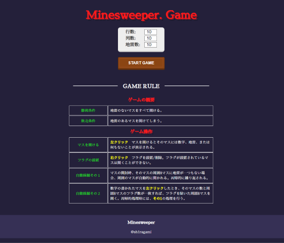
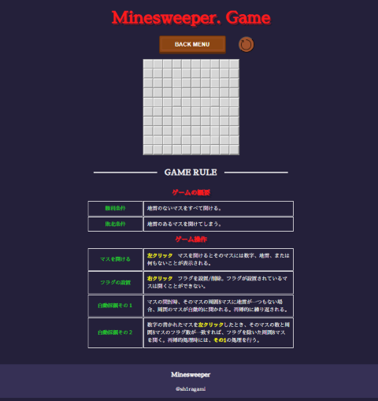

Title <マインスイーパー>  

---ゲーム進行--- 
　行、列、地雷数を入力 
　ボードを作成 
　地雷を踏むまで採掘、フラグ設置を繰り返す 
　採掘した周囲8マスに地雷がない場合、周囲を自動採掘。再帰的に繰り返す。  
 
---クリア条件--- 
　地雷以外のすべてのセルを掘り終えるとクリア  
 
 ---操作方法--- 
 　左クリック　採掘 
 　右クリック　フラグを設置 

Top画面 

GamePlay画面
GameBoard　例

